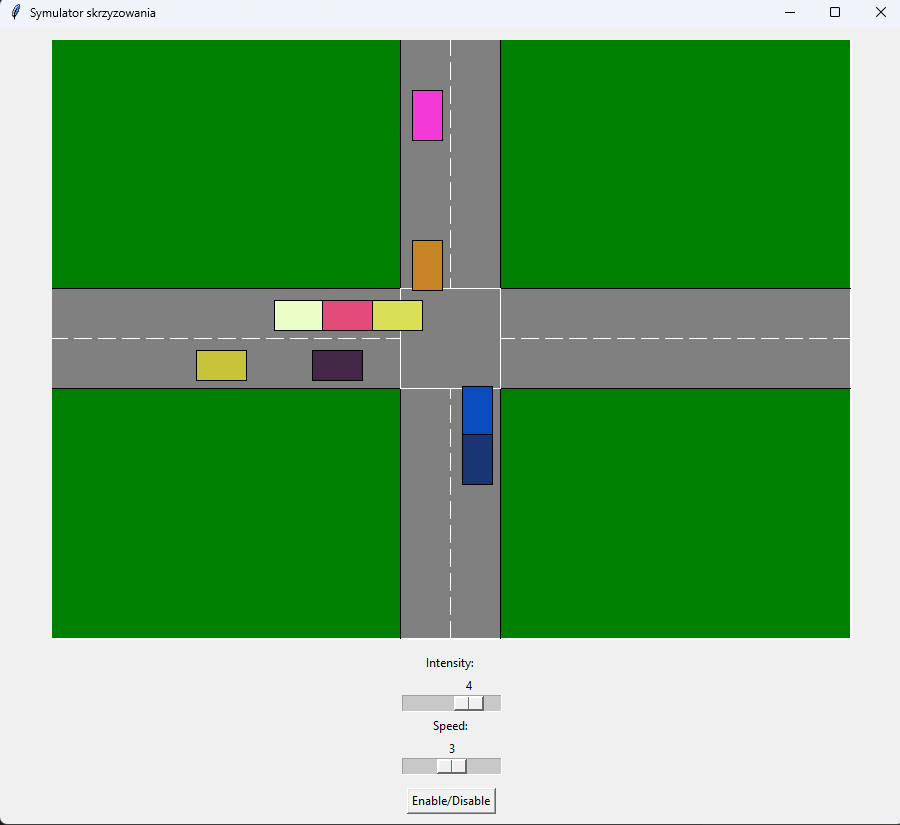

# Symulator skrzyżowania

prowadzący: dr inż. Tomasz Szandała

## Cel projektu
Celem projektu było wykonanie aplikacji symulującej skrzyżowanie wykorzystując wielowątkowość oraz sekcje krytyczne w języku Python. 
Do rysowania skrzyżowania została wykorzystana biblioteka Tkinter. 

## Opis projektu
Projekt składa się z czterech klas odpowiadających za obsługę skrzyżowania oraz samochodów. Pierwszeństwo na skrzyżowaniu determinowane jest na zasadzie "kto pierwszy ten lepszy". W przypadku w którym na skrzyżowaniu znajdują się samochody jadąde góra-dół oraz dół-góra, samochody jadące lewo-prawo oraz prawo-lewo muszą poczekać aż skrzyżowanie będzie wolne. W trakcie czekania lub dojeżdżania do wolniejszego samochodu samochody nie mogą na siebie nawzajem wjeżdżać.

## Opis klas
+ klasa `Interserction` odpowiada za utworzenie kanwy oraz narysowanie na niej skrzyżowania.
+ klasa `Car` odpowiada za rysowanie oraz przesuwanie samochodem. Znajdujący się w niej wątek sprawdza, czy może się przesunąć. Zależy to od tego, czy nie ma on żadnych samochodów przed sobą, a także czy nie wjeżdża na skrzyżowanie, na którym jadą już pojazdy posiadające pierwszeństwo. Kiedy samochód przejedzie już całą trasę, jest on usuwany z kanwy a jego wątek jest zatrzymywany. 
+ klasa `Direction` odpowiada za koordynaty oraz kierunek i prędkość poruszania się samochodów.
+ klasa `CarGenerator` odpowiada za losowe tworzenie nowych samochów. Prędkość nadawana samochodom oraz intensywność ich tworzenia zależy od sliderów znajdującym się na interfejsie graficznym.

## Sekcje krytyczne
Jako sekcję krytyczną zaimplementowaliśmy semafor, który umożliwia poruszanie się 15 pierwszym samochodom pojawiającym się na jezdni. Celem takiego rozwiązania jest przeciwdziałanie sytuacji, w której przy dużej ilości samochodów na skrzyżowaniu samochody na pasach posiadających pierwszeństwo nie blokowały pernamentnie pozostałych samochodów.

## Zrzut ekranu 

## Autorzy:
+ Jakub Grelowski 262754
+ Filip Panek 252794
